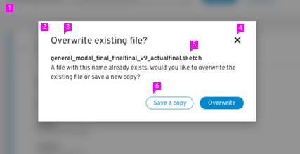

# Modal
Modals load and display important information without navigating away from the current page.

## Elements of a modal

1. **Backdrop**
2. **Modal box**
3. **Title:** Concisely convey the purpose of the modal.
4. **Close**
5. **Content area**
6. **Buttons:** Action buttons should be right aligned. Make your primary action the right-most button.

## Usage
### When to use
Use a modal when information is critical and requires user input or attention.
Use modals to:
* Validate user decisions
* Report errors
* Provide the result of a task or state of an application
* Get required user input
* Show additional information in-context

### When not to use
Modals interrupt user task flow and should be avoided for any information that is not critical to user success.

### Content Guidelines
* Clearly restate the action the user is trying to take and explicitly outline the consequences of that action.

* Provide buttons labels that make it simple for users to understand and confirm their choices. Use descriptive verbs that clearly indicate the consequence of a selection, like Delete, Save, or Create. Avoid vague labels like OK or Done.

* Use descriptive title and button labels so the user can scan  content and make a decision quickly. Ambiguous title and button labels make it more difficult for the user to understand their options and make a decision.

### Related components
* [Message Dialogs](../message_dialog)
* [About Modal](../about-modal)
