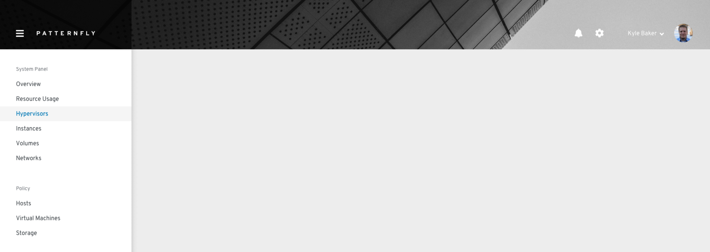
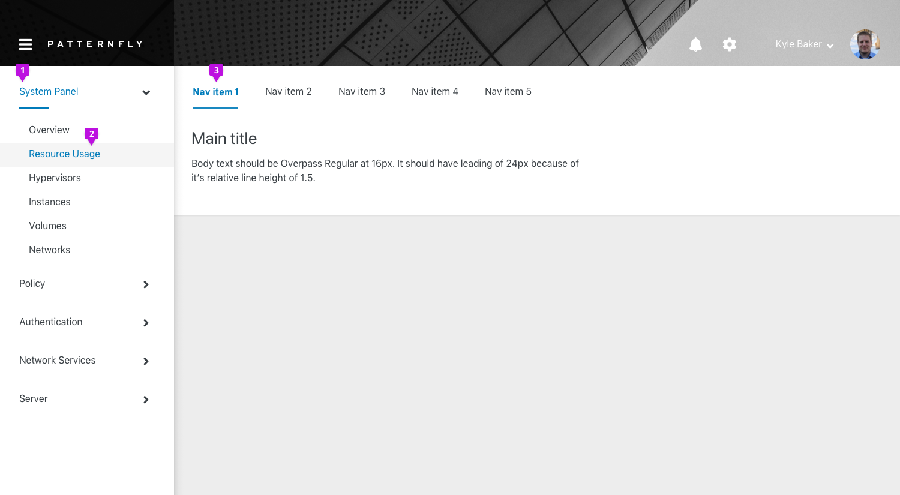

# Navigation system
Navigation is used to organize an application’s structure and content, making it easy to find information and accomplish tasks. Navigation communicates relationships, context, and actions a user can take within an application.

### Vertical navigation

Vertical navigation is hierarchical global navigation that displays nav items from top to bottom on the left side of a screen. PatternFly vertical navigation can be collapsed to provide additional screen real estate by using the icon at the top left. Vertical nav items can be displayed with or without icons.

#### When to use
* You have five or more primary navigation items
* You have secondary navigation items (even if you have less than five primary navigation items
* You want to use icons to represent navigation items
* You expect your application to be used on desktop, laptop, and mobile devices

#### Variations
**Simple vertical navigation**
Use simple vertical navigation when you only have one level of navigation to display and more than five primary nav items. If you have five nav items or less, you may want to use horizontal navigation.

**With secondary navigation**

When you have a small amount of secondary nav items, you can display them persistently beneath the primary navigation items.

**Expandable**

When you have a large number of secondary navigation items, you can use an expandable navigation to collapse and expand options as needed.

### Horizontal navigation

Horizontal navigation is global navigation that displays nav items from left to right at the top of an interface.

#### When to use
* You have less than five primary navigation items
* You have only one level of navigation and no secondary navigation items

### Tertiary navigation

Use tertiary navigation when you need navigation specific to a particular window or tab in the interface. Tertiary navigation is provided in addition to global navigation.

### Context selector

Use a context selector in addition to your global navigation when the data or resources you need to show in the interface are dependant on the users’ context. For example, you may need to display details about different regions, projects, or organizations.
